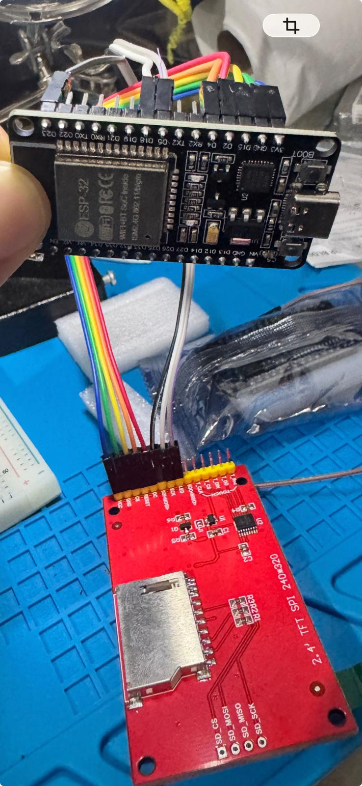
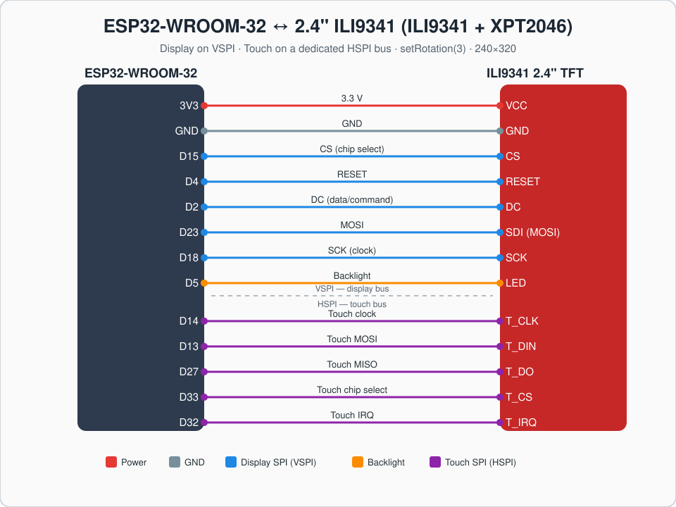
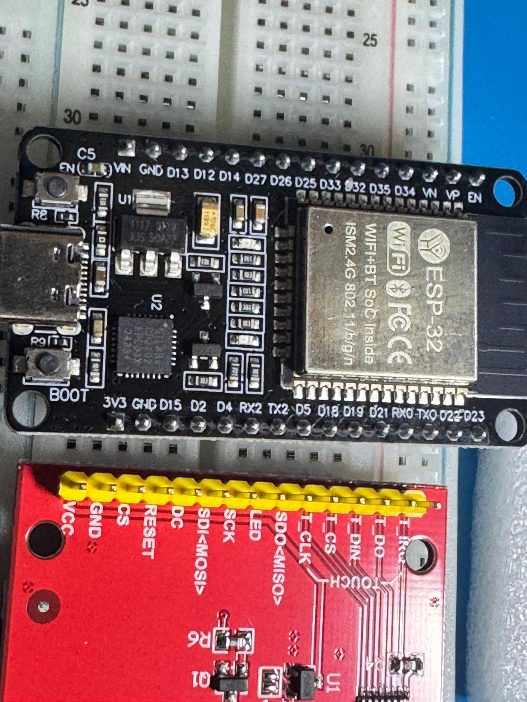
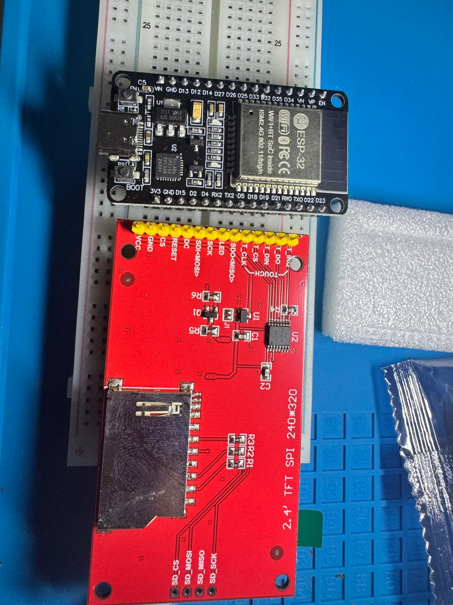

# ESP32-WROOM + 2.4" ILI9341 Touchscreen — Snake and test firmware

A small embedded project built to learn the ESP32 and SPI displays from the
ground up: wiring a 2.4" ILI9341 TFT with an XPT2046 resistive touch panel to
an ESP32-WROOM-32, getting the display and touch working, and then writing a
playable **Snake** game controlled entirely by touch.

The repository keeps every step, not just the final game: the display bring-up
test, the touch test with auto-calibration, the game, and the notes on how I
solved the USB driver problem on the way.



---

## Hardware

| Part | Details |
|------|---------|
| MCU board | ESP32-WROOM-32 DevKit, 30 pins, ESP32-D0WD-V3 |
| USB-serial | Silicon Labs CP2102 (CP210x driver) |
| Display | 2.4" TFT SPI, ILI9341 controller, 240×320 |
| Touch | XPT2046 resistive controller (on the same board) |
| Extra | microSD slot on the display board (unused here) |

---

## Wiring

The display runs on the ESP32's **VSPI** bus. The touch controller runs on a
**separate HSPI** bus with its own pins. Because the two never share a signal,
every connection is a single direct jumper — no breadboard and no doubled-up
wires.



### Display (VSPI)

| Display | ESP32 | Signal |
|---------|-------|--------|
| VCC | 3V3 | Power |
| GND | GND | Ground |
| CS | D15 | Chip select |
| RESET | D4 | Reset |
| DC | D2 | Data/command |
| SDI (MOSI) | D23 | MOSI |
| SCK | D18 | Clock |
| LED | D5 | Backlight |

### Touch — XPT2046 (HSPI)

| Display | ESP32 |
|---------|-------|
| T_CLK | D14 |
| T_DIN | D13 |
| T_DO | D27 |
| T_CS | D33 |
| T_IRQ | D32 |

Display orientation in firmware: `setRotation(3)` (landscape, matching how the
panel is mounted).

> **Boot note:** DC (D2) and CS (D15) are ESP32 strapping pins. With the display
> attached, if an upload stalls at "Connecting...", hold the BOARD's BOOT button
> during the upload. On this unit the auto-reset worked without it.

The connector labels are printed on the display's pin header:

| Board + display header labels | Display back (controller + SD slot) |
|---|---|
|  |  |

---

## Why two SPI buses

The XPT2046 touch controller and the ILI9341 display both speak SPI. The common
approach (TFT_eSPI's built-in touch) puts them on the **same** bus, so the touch
has to share the clock (SCK) and data (MOSI) lines with the display. Sharing one
ESP32 pin between two devices means doubling wires on a single header pin, which
needs a breadboard or a splice.

The ESP32 has two general-purpose SPI peripherals (VSPI and HSPI). Here the
touch gets its **own** bus on free pins, so every signal has a dedicated ESP32
pin and every jumper is a straight point-to-point connection. The touch is
driven directly in code instead of through the library's touch layer.

---

## Repository layout

| Path | What it is |
|------|------------|
| `snake/` | The game — touch-controlled Snake, high score in flash, wall wrap |
| `tft-test/` | Display bring-up test (color flashes + text) to confirm the wiring |
| `touch-test/` | Touch test with 3-point auto-calibration and a free-draw mode |
| `drivers/` | CP210x driver (extracted INF) and the install scripts |
| `User_Setup.h` | TFT_eSPI pin reference (for Arduino IDE builds) |
| `docs/images/` | Wiring diagram and photos |

Each firmware folder is a self-contained PlatformIO project.

---

## Build and flash (PlatformIO)

Requirements: VS Code + PlatformIO. On Windows the CLI lives at
`C:\Users\<user>\.platformio\penv\Scripts\pio.exe`.

```bash
# from inside snake/ (or tft-test/ / touch-test/)
pio run -t upload          # build and flash (COM port set in platformio.ini)
pio device monitor         # serial monitor at 115200
```

The display pin mapping is passed through `build_flags` in each
`platformio.ini`, so the TFT_eSPI library's `User_Setup.h` does not need to be
edited.

---

## How it works

### Talking to the XPT2046 directly

The touch controller is a simple SPI device. You send one command byte and read
back a 12-bit sample:

- `0xD0` returns the X channel, `0x90` returns the Y channel.
- The 16 bits read back hold the result left-aligned, so the code shifts right
  by 3 to get the 12-bit value.
- Several samples are averaged, and obviously bad readings are discarded, to
  keep a resistive panel steady.

This is `xptRead()` and `readRaw()` in `snake/src/main.cpp` and
`touch-test/src/main.cpp`.

### Touch calibration

Raw touch values are not screen coordinates, and the touch axes can be rotated
relative to the display. The calibration asks the user to tap three corner
targets (top-left, top-right, bottom-left):

1. Going top-left → top-right tells the code which raw axis changes with the
   screen's X. If the Y raw channel moves more, the axes are swapped.
2. Two opposite corners give the raw range for each screen axis.
3. A linear `map()` then converts any raw reading into a screen pixel.

The result (axis swap flag + four range values) is stored in flash with
`Preferences`, so the calibration survives power cycles. Holding the screen for
two seconds on the Snake menu runs it again.

### Snake

- The playfield is a grid (10 px cells). The snake is an array of cells with the
  head at index 0; each step shifts the body and writes a new head.
- Only the changed cells are redrawn each step (erase the old tail, draw the new
  head), which keeps it flicker-free without a full-screen redraw.
- Walls wrap with a modulo, so the snake leaves one edge and comes back on the
  other (Nokia style).
- **Control:** a tap is read relative to the snake's head — tap above the head
  to go up, below to go down, left or right to turn that way. A 180° reversal is
  ignored so the snake cannot run into its own neck.
- Speed increases slightly with every piece of food. The high score is kept in
  flash alongside the calibration.
- A small state machine drives the menu, play, and game-over screens.

---

## The CP210x driver problem (and fix)

Windows did not have the CP2102 driver, so the board showed up with an error and
no COM port. The direct download from the vendor was blocked, and Windows Update
found the driver but failed to bind it. What worked:

1. Download the signed driver CAB from the **Microsoft Update Catalog**
   (search the hardware id `USB\VID_10C4&PID_EA60`, package
   *Silicon Laboratories Inc. Ports*).
2. Extract it with `expand.exe` into `drivers/cp210x_extracted/`.
3. Install it elevated: `pnputil /add-driver silabser.inf /install`.

After that the board enumerated as *Silicon Labs CP210x USB to UART Bridge*.
The `drivers/` folder keeps the extracted INF and the scripts used.

---

## Notes

Built on an ESP32-WROOM-32 with the Arduino core via PlatformIO. The display is
driven with the TFT_eSPI library; the touch controller is handled directly in
the sketch.
